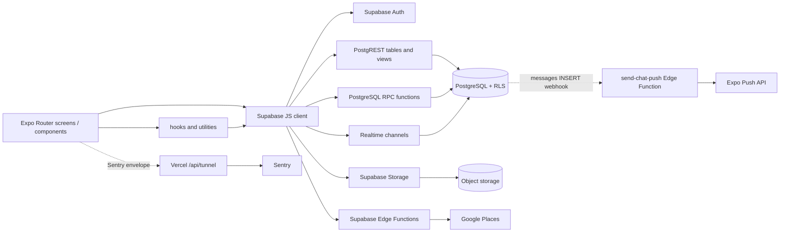
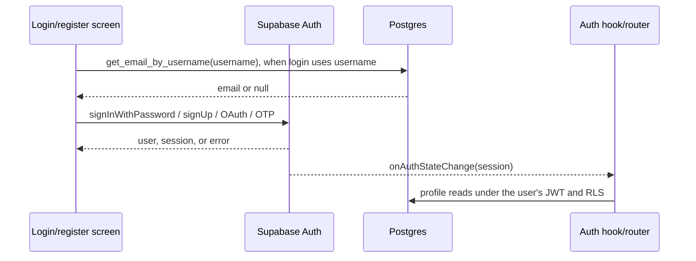
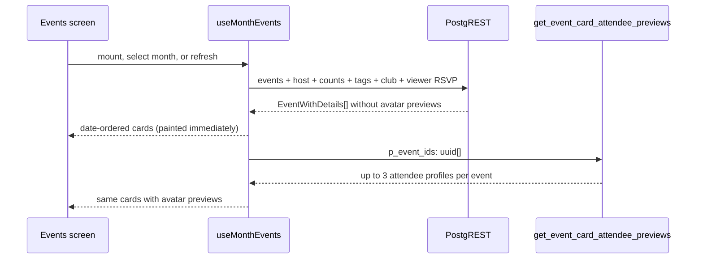
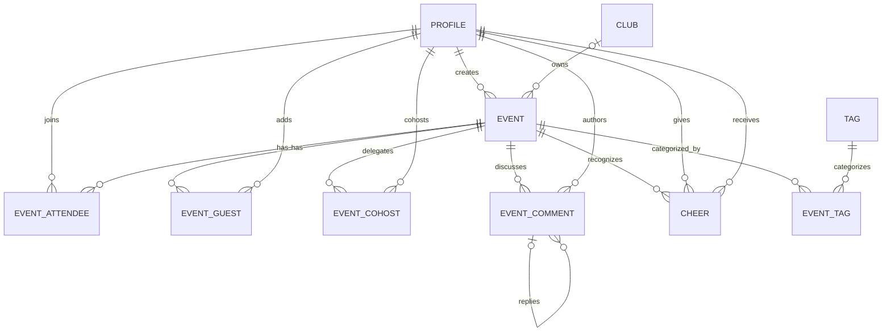
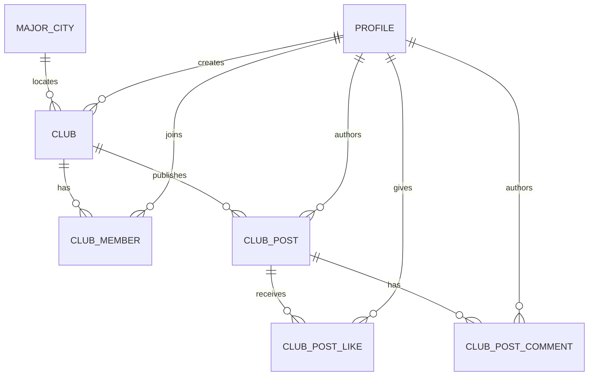
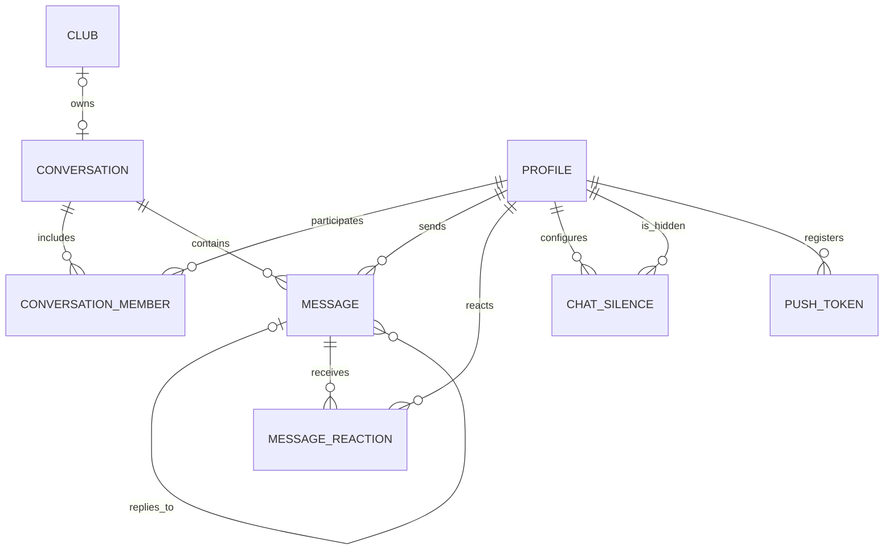
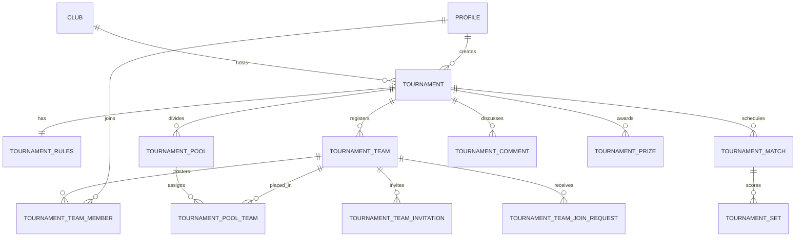

# Frontend/backend request, response, and data model

The human-written explanation was reviewed against `main` at commit `c70ead2`.
The generated inventory later in this file is refreshed from the checked-out
code by `npm run docs:update` and enforced by CI.

This document describes the contracts that are visible in this repository. It
does **not** claim that the checked-in migrations reproduce the live Supabase
project: the migration folder is known to be incomplete, so the live database
must be checked before changing a table, policy, trigger, or function.

## Start here

| If you want to… | Read… |
|---|---|
| Understand the system in two minutes | [Architecture at a glance](#architecture-at-a-glance) |
| See the shape of a Supabase request and response | [What a request and response look like](#what-a-request-and-response-look-like) |
| Follow a feature end to end | [Main request flows](#main-request-flows) |
| Find every table, RPC, auth, Realtime, Storage, model, or constrained value currently referenced by code | [Generated code inventory](#generated-code-inventory) |
| Check known type/schema hazards before backend work | [Known contract gaps](#known-contract-gaps-to-resolve-before-schema-work) |

The prose and diagrams are deliberately written for humans. The repetitive
inventory is generated and committed in this same file so GitHub renders one
readable source of truth. Run:

```bash
npm run docs:update   # rewrite the generated inventory after code changes
npm run docs:check    # verify it is already current; CI runs this on every PR
```

CI does not make a follow-up commit after merge. It blocks the PR before merge
if the inventory is stale, so code and its documentation land atomically.

## Architecture at a glance

vteam does not have a conventional application API with controllers and DTOs.
The Expo/React Native frontend usually calls Supabase directly with
`@supabase/supabase-js`. The public project URL and anon key create the client;
after sign-in, Supabase attaches the user's JWT and PostgreSQL Row Level
Security (RLS) decides what that user may read or change
([`lib/supabase.ts:6`](../lib/supabase.ts#L6),
[`lib/supabase.ts:17`](../lib/supabase.ts#L17)).


```mermaid
flowchart LR
  UI[Expo Router screens / components] --> H[hooks and utilities]
  UI --> S[Supabase JS client]
  H --> S
  S --> A[Supabase Auth]
  S --> P[PostgREST tables and views]
  S --> R[PostgreSQL RPC functions]
  S --> RT[Realtime channels]
  S --> ST[Supabase Storage]
  S --> EF[Supabase Edge Functions]
  P --> DB[(PostgreSQL + RLS)]
  R --> DB
  RT --> DB
  ST --> OBJ[(Object storage)]
  EF --> GP[Google Places]
  DB -. messages INSERT webhook .-> PUSH[send-chat-push Edge Function]
  PUSH --> EXPO[Expo Push API]
  UI -. Sentry envelope .-> VT[Vercel /api/tunnel]
  VT --> SENTRY[Sentry]
```

The server-only exceptions are:

- `places-proxy`, which accepts a small JSON request and keeps the Google Maps
  key off the client
  ([`components/LocationPickerField.tsx:73`](../components/LocationPickerField.tsx#L73),
  [`supabase/functions/places-proxy/index.ts:35`](../supabase/functions/places-proxy/index.ts#L35));
- `send-chat-push`, which receives a database webhook after a message insert,
  uses the service role to find recipients, and calls Expo Push
  ([`supabase/functions/send-chat-push/index.ts:1`](../supabase/functions/send-chat-push/index.ts#L1));
- `/api/tunnel`, a Vercel function that validates and forwards Sentry envelopes
  ([`api/tunnel.ts:5`](../api/tunnel.ts#L5)).

### Why the venue picker calls Places the way it does

Google Places is the only metered third-party API in the app, so the client
side of `places-proxy` is shaped around *not* spending it. Five deliberate
mechanisms, all in
[`components/LocationPickerField.tsx`](../components/LocationPickerField.tsx):

1. **A session token per modal open.** Autocomplete requests and the closing
   Place Details lookup share one `sessiontoken`, so Google bills the whole
   search as a single session instead of per keystroke. A fresh token is minted
   on each open, and the token is spent by the Details call on selection.
2. **A three-character floor and a 600ms debounce.** Nothing reaches the
   network until the query is worth running, which collapses a typed venue name
   into roughly one request.
3. **A two-layer cache.** A module-level `Map` for the session and a 24h
   `AsyncStorage` entry keyed `gmaps:<v>:<query>` across launches. A cache hit
   returns predictions without a request *and* without consuming the session
   token.
4. **Recent and common venues are answered locally.** Re-picking a venue the
   host has used before, or one of the `LOCATIONS` constants, resolves from
   state with zero Places traffic — which is the dominant case for a club that
   plays the same gyms every week.
5. **`fields=geometry` on Details.** The narrowest Basic-Data field set, so the
   closing call stays in the cheapest tier.

Note that `latitude`/`longitude` are currently **write-only**: they are stored
and round-tripped through the host form, but nothing reads them — "Show in
Maps" builds a text query from `location` instead
([`components/event/DetailsTab.tsx:22`](../components/event/DetailsTab.tsx#L22)).
The Details call is kept anyway because it fires once per *saved event* rather
than per keystroke, so its volume is negligible, and dropping it would discard
the coordinates that a future distance sort or map view would need.

## What a request and response look like

| Interface | Request shape | Response shape | Contract location |
|---|---|---|---|
| Auth | `supabase.auth.<operation>(payload)` | Supabase `{ data, error }`; session changes also arrive through `onAuthStateChange` | [`app/(auth)/login.tsx:98`](../app/%28auth%29/login.tsx#L98), [`lib/socialAuth.ts:11`](../lib/socialAuth.ts#L11), [`hooks/useAuth.ts:15`](../hooks/useAuth.ts#L15) |
| Table/view read | `.from(table).select(projection)` plus filters, ordering, range, or count options | `{ data, error, count, status, ... }`; `data` is an array unless `.single()`/`.maybeSingle()` is used | [`hooks/useMonthEvents.ts`](../hooks/useMonthEvents.ts), [`hooks/useNotifications.ts:29`](../hooks/useNotifications.ts#L29) |
| Table write | `.insert()`, `.upsert()`, `.update()`, or `.delete()`; append `.select()` only when returned rows are needed | Metadata/error only by default; inserted/updated rows when followed by `.select()` | [`app/(app)/host.tsx:276`](../app/%28app%29/host.tsx#L276), [`hooks/useMessages.ts:180`](../hooks/useMessages.ts#L180) |
| Database RPC | `supabase.rpc(name, namedArguments?)` | Function-specific `data` plus `error` | [`hooks/useConversations.ts:14`](../hooks/useConversations.ts#L14), [`utils/eventCardPreviews.ts:23`](../utils/eventCardPreviews.ts#L23) |
| Realtime | `.channel().on('postgres_changes', filter, callback).subscribe()` | Change payload (`new`/`old` rows); the app often re-fetches a fully joined row after receiving it | [`hooks/useMessages.ts:82`](../hooks/useMessages.ts#L82), [`hooks/useConversations.ts:48`](../hooks/useConversations.ts#L48) |
| Storage | bucket-scoped `upload`, `remove`, `getPublicUrl`, or signed URL operations | `{ data, error }`; database rows store an object path or URL | [`hooks/useMessages.ts:258`](../hooks/useMessages.ts#L258), [`constants/storage.ts:1`](../constants/storage.ts#L1) |
| Edge Function | `supabase.functions.invoke(name, { body })` | Parsed response body as `data` plus `error` | [`components/LocationPickerField.tsx:73`](../components/LocationPickerField.tsx#L73) |

PostgREST projections are also response schemas. For example, a relationship
selection such as `profiles!events_created_by_fkey (...)` produces a nested
`profiles` object, while `event_attendees_attending(count)` produces a
one-element count array. Aliases such as
`my_attendance:event_attendees_attending(user_id)` become response property
names. The canonical event-card projection is centralized in
[`constants/events.ts:92`](../constants/events.ts#L92), and the matching joined
response is `EventWithDetails`
([`types/index.ts:253`](../types/index.ts#L253)).

The TypeScript types are handwritten assertions about those response shapes;
there is no generated Supabase `Database` type parameter on `createClient`.
Many call sites therefore cast returned rows with `as`, `as unknown as`, or
`any`. TypeScript validates use after the cast, but it cannot prove the live
database returned the claimed shape.

## Main request flows

### Authentication and session


```mermaid
sequenceDiagram
  participant Screen as Login/register screen
  participant Auth as Supabase Auth
  participant DB as Postgres
  participant App as Auth hook/router
  Screen->>DB: get_email_by_username(username), when login uses username
  DB-->>Screen: email or null
  Screen->>Auth: signInWithPassword / signUp / OAuth / OTP
  Auth-->>Screen: user, session, or error
  Auth-->>App: onAuthStateChange(session)
  App->>DB: profile reads under the user's JWT and RLS
```

- Password login optionally resolves a username through
  `get_email_by_username(p_username)` and then calls
  `signInWithPassword({ email, password })`
  ([`app/(auth)/login.tsx:103`](../app/%28auth%29/login.tsx#L103)).
- Registration checks `profiles.username`, calls `auth.signUp`, and updates the
  trigger-created profile with names
  ([`app/(auth)/register.tsx:55`](../app/%28auth%29/register.tsx#L55)).
- OAuth supports authorization-code or access/refresh-token callbacks; native
  Apple login can exchange an identity token directly
  ([`lib/socialAuth.ts:11`](../lib/socialAuth.ts#L11),
  [`lib/socialAuth.ts:66`](../lib/socialAuth.ts#L66)).
- The session is persisted in AsyncStorage on client platforms. Static web
  export uses no-op storage and does not persist a server-render session
  ([`lib/supabase.ts:9`](../lib/supabase.ts#L9)).

### Event lists and event detail


```mermaid
sequenceDiagram
  participant UI as Events screen
  participant Hook as useMonthEvents
  participant REST as PostgREST
  participant RPC as get_event_card_attendee_previews
  UI->>Hook: mount, select month, or refresh
  Hook->>REST: events + host + counts + tags + club + viewer RSVP
  REST-->>Hook: EventWithDetails[] without avatar previews
  Hook-->>UI: date-ordered cards (painted immediately)
  Hook->>RPC: p_event_ids: uuid[]
  RPC-->>Hook: up to 3 attendee profiles per event
  Hook-->>UI: same cards with avatar previews
```

- The feed paints as soon as the event rows arrive; at most three attendee
  previews per event follow from a second RPC and are merged into the cached
  month only if no newer fetch replaced it meanwhile
  ([`hooks/useMonthEvents.ts`](../hooks/useMonthEvents.ts),
  [`utils/eventCardPreviews.ts`](../utils/eventCardPreviews.ts)). The
  preview RPC is `SECURITY INVOKER`, so it retains the caller's database
  permissions
  ([`supabase/migrations/20260811030000_event_card_attendee_previews_rpc.sql:2`](../supabase/migrations/20260811030000_event_card_attendee_previews_rpc.sql#L2)).
- `useMonthEvents` performs the event and tournament reads in parallel over a
  month span, normalizes tournaments into the `EventWithDetails` card shape, and
  marks them with the UI-only `_isTournament` flag
  ([`hooks/useMonthEvents.ts:28`](../hooks/useMonthEvents.ts#L28),
  [`hooks/useMonthEvents.ts:127`](../hooks/useMonthEvents.ts#L127)).
- `events.event_date` is an instant, but calendars group it by the viewer's
  local day. Suffix-less PostgREST timestamps are interpreted as UTC before
  `eventLocalDateKey` derives the shared `YYYY-MM-DD` key used by dots and
  feed sections; month queries use local-midnight boundaries converted to ISO
  instants
  ([`utils/index.ts:170`](../utils/index.ts#L170),
  [`utils/index.ts:193`](../utils/index.ts#L193),
  [`utils/monthKeys.ts:19`](../utils/monthKeys.ts#L19)).
- Event detail fetches the event, creator, full attendee/profile rows, and tags.
  It then fetches comments plus guests/cohosts in additional requests
  ([`app/(app)/event/[id].tsx:464`](../app/%28app%29/event/%5Bid%5D.tsx#L464)).
- Creating or editing an event is a client-orchestrated series of writes:
  `events`, then `event_tags`, optionally `user_event_templates`, plus waitlist
  updates on capacity changes
  ([`app/(app)/host.tsx:270`](../app/%28app%29/host.tsx#L270)). These steps are not
  wrapped in one database transaction, so a later failure can leave an earlier
  write committed. On edit, tag writes are narrowed to the difference between
  the loaded database set and current form selection: additions are inserted,
  removals target only dropped IDs, and an unchanged set performs no tag write.
  If removal fails after additions land, the client compensates by deleting
  those additions before showing the partial-save warning; a failed
  compensation is reported as an uncertain tag state rather than as unchanged
  ([`app/(app)/host.tsx:327`](../app/%28app%29/host.tsx#L327),
  [`utils/index.ts:471`](../utils/index.ts#L471)).
- Price has separate form and persistence contracts. `CreateEventForm.priceText`
  preserves in-progress decimal input as text; the submit boundary sanitizes
  and converts it once to the `events.price` number, rounded to cents, with
  empty or zero represented as `null`. Response formatting then renders
  fractional values with two decimal places
  ([`types/index.ts:305`](../types/index.ts#L305),
  [`utils/index.ts:171`](../utils/index.ts#L171),
  [`utils/index.ts:190`](../utils/index.ts#L190),
  [`app/(app)/host.tsx:278`](../app/%28app%29/host.tsx#L278)).

The event entity cluster is:


```mermaid
erDiagram
  PROFILE ||--o{ EVENT : creates
  PROFILE ||--o{ EVENT_ATTENDEE : joins
  EVENT ||--o{ EVENT_ATTENDEE : has
  EVENT ||--o{ EVENT_GUEST : has
  PROFILE ||--o{ EVENT_GUEST : adds
  EVENT ||--o{ EVENT_COHOST : delegates
  PROFILE ||--o{ EVENT_COHOST : cohosts
  EVENT ||--o{ EVENT_COMMENT : discusses
  PROFILE ||--o{ EVENT_COMMENT : authors
  EVENT_COMMENT o|--o{ EVENT_COMMENT : replies
  EVENT ||--o{ CHEER : recognizes
  PROFILE ||--o{ CHEER : gives
  PROFILE ||--o{ CHEER : receives
  EVENT ||--o{ EVENT_TAG : categorized_by
  TAG ||--o{ EVENT_TAG : categorizes
  CLUB o|--o{ EVENT : owns
```

### Profiles and cheers

- The own-profile screen loads the signed-in `profiles` row and an exact,
  head-only count of `cheers` rows where that profile is the receiver in
  parallel. Pull-to-refresh repeats both the profile and Cheers reads; a failed
  count refresh retains the last known value instead of replacing it with a
  misleading zero. The same receiver relationship drives the existing Cheers
  detail screen, so the card total and detail total share one database contract
  ([`app/(app)/(tabs)/(main)/profile/index.tsx`](../app/%28app%29/%28tabs%29/%28main%29/profile/index.tsx),
  [`app/(app)/(tabs)/settings/cheers.tsx`](../app/%28app%29/%28tabs%29/settings/cheers.tsx)).

### Clubs

Club screens use direct PostgREST reads and writes:

- `clubs` belongs to a `major_cities` row and has many `club_members`; the
  creator is inserted as an owner by a database trigger
  ([`types/index.ts:337`](../types/index.ts#L337),
  [`supabase/migrations/20260419120000_club_creation_and_location.sql:20`](../supabase/migrations/20260419120000_club_creation_and_location.sql#L20)).
- A club has events and a feed of `club_posts`; posts have `club_post_likes` and
  `club_post_comments`. The checked-in RLS policies allow members to read and
  interact while only owners create posts
  ([`supabase/migrations/20260421120000_club_posts.sql:47`](../supabase/migrations/20260421120000_club_posts.sql#L47)).
- Club images are uploaded to `club-avatars`; the database stores their object
  path
  ([`app/(app)/club/[id].tsx:257`](../app/%28app%29/club/%5Bid%5D.tsx#L257)).


```mermaid
erDiagram
  MAJOR_CITY ||--o{ CLUB : locates
  PROFILE ||--o{ CLUB : creates
  CLUB ||--o{ CLUB_MEMBER : has
  PROFILE ||--o{ CLUB_MEMBER : joins
  CLUB ||--o{ CLUB_POST : publishes
  PROFILE ||--o{ CLUB_POST : authors
  CLUB_POST ||--o{ CLUB_POST_LIKE : receives
  PROFILE ||--o{ CLUB_POST_LIKE : gives
  CLUB_POST ||--o{ CLUB_POST_COMMENT : has
  PROFILE ||--o{ CLUB_POST_COMMENT : authors
```

### Chat

- The conversation list is not assembled in the client. The frontend invokes
  `get_my_conversations()` and casts its result to `ConversationRow[]`; that row
  includes the last message, unread count, other DM member, or club identity
  ([`hooks/useConversations.ts:14`](../hooks/useConversations.ts#L14),
  [`types/index.ts:480`](../types/index.ts#L480)).
- Opening a DM invokes `find_or_create_dm(other_user_id)` and expects one
  conversation UUID
  ([`app/(app)/(tabs)/chat.tsx:193`](../app/%28app%29/%28tabs%29/chat.tsx#L193)).
- A message page fetches 40 messages at a time with sender and reaction embeds,
  then separately fetches referenced reply messages to avoid an ambiguous
  self-join
  ([`hooks/useMessages.ts:6`](../hooks/useMessages.ts#L6),
  [`hooks/useMessages.ts:17`](../hooks/useMessages.ts#L17)).
- Sending inserts a `messages` row and asks PostgREST to return the joined
  `MessageWithDetails` projection. An optimistic `_sending` row exists only in
  client memory until confirmation
  ([`hooks/useMessages.ts:137`](../hooks/useMessages.ts#L137),
  [`types/index.ts:524`](../types/index.ts#L524)).
- Realtime `messages` and `message_reactions` changes update or re-fetch client
  state. `mark_conversation_read(p_conversation_id)` updates server-side read
  state
  ([`hooks/useMessages.ts:88`](../hooks/useMessages.ts#L88),
  [`hooks/useMessages.ts:292`](../hooks/useMessages.ts#L292)).
- Image messages upload to the public `chat-images` bucket and store the public
  URL in `messages.image_url`
  ([`hooks/useMessages.ts:258`](../hooks/useMessages.ts#L258)).
- A message insert can independently trigger the `send-chat-push` database
  webhook. That service-role flow does not participate in the frontend insert
  response; push delivery is asynchronous and best-effort.


```mermaid
erDiagram
  CONVERSATION ||--o{ CONVERSATION_MEMBER : includes
  PROFILE ||--o{ CONVERSATION_MEMBER : participates
  CLUB o|--o| CONVERSATION : owns
  CONVERSATION ||--o{ MESSAGE : contains
  PROFILE ||--o{ MESSAGE : sends
  MESSAGE o|--o{ MESSAGE : replies_to
  MESSAGE ||--o{ MESSAGE_REACTION : receives
  PROFILE ||--o{ MESSAGE_REACTION : reacts
  PROFILE ||--o{ CHAT_SILENCE : configures
  PROFILE ||--o{ CHAT_SILENCE : is_hidden
  PROFILE ||--o{ PUSH_TOKEN : registers
```

`Conversation` and `ConversationMember` raw-row types are notably absent from
`types/index.ts`; the principal client contract is the RPC response
`ConversationRow`.

### Notifications and badges

- The inbox reads at most 80 `notifications` rows. The unread badge uses an
  exact, `head: true` count so row bodies are not downloaded
  ([`hooks/useNotifications.ts:23`](../hooks/useNotifications.ts#L23),
  [`hooks/useNotifications.ts:38`](../hooks/useNotifications.ts#L38)).
- `mark_notification_read` and `mark_all_notifications_read` are
  security-definer RPCs that still scope updates to `auth.uid()`
  ([`supabase/migrations/20260402120000_notifications_inbox.sql:97`](../supabase/migrations/20260402120000_notifications_inbox.sql#L97)).
- Checked-in triggers fan out event announcements, material event changes,
  cancellations, and waitlist promotions into inbox rows
  ([`supabase/migrations/20260402120100_notifications_triggers.sql:7`](../supabase/migrations/20260402120100_notifications_triggers.sql#L7)).
- Badge qualification is currently client-orchestrated: the utility reads
  attendance/events/cheers, plans awards, inserts or updates `user_badges`, and
  inserts badge notifications
  ([`utils/badges.ts:25`](../utils/badges.ts#L25),
  [`utils/badges.ts:178`](../utils/badges.ts#L178)).
- Notification preferences are JSON in `profiles.notification_prefs`, keyed by
  notification type and channel (`in_app` or `push`)
  ([`types/index.ts:69`](../types/index.ts#L69)).

### Tournaments

Tournament creation inserts the parent `tournaments` row and then its
one-to-one `tournament_rules` row; this is another client-orchestrated,
non-transactional sequence
([`app/(app)/tournament/create.tsx:668`](../app/%28app%29/tournament/create.tsx#L668)).
Tournament detail then loads the parent/rules/prizes in parallel and separately
loads teams, members, invitations, join requests, discussion, pools, matches,
and sets as the screen needs them
([`app/(app)/tournament/[id].tsx:168`](../app/%28app%29/tournament/%5Bid%5D.tsx#L168)).


```mermaid
erDiagram
  CLUB ||--o{ TOURNAMENT : hosts
  PROFILE ||--o{ TOURNAMENT : creates
  TOURNAMENT ||--|| TOURNAMENT_RULES : has
  TOURNAMENT ||--o{ TOURNAMENT_TEAM : registers
  TOURNAMENT_TEAM ||--o{ TOURNAMENT_TEAM_MEMBER : rosters
  PROFILE ||--o{ TOURNAMENT_TEAM_MEMBER : joins
  TOURNAMENT ||--o{ TOURNAMENT_POOL : divides
  TOURNAMENT_POOL ||--o{ TOURNAMENT_POOL_TEAM : assigns
  TOURNAMENT_TEAM ||--o{ TOURNAMENT_POOL_TEAM : placed_in
  TOURNAMENT ||--o{ TOURNAMENT_MATCH : schedules
  TOURNAMENT_MATCH ||--o{ TOURNAMENT_SET : scores
  TOURNAMENT ||--o{ TOURNAMENT_COMMENT : discusses
  TOURNAMENT ||--o{ TOURNAMENT_PRIZE : awards
  TOURNAMENT_TEAM ||--o{ TOURNAMENT_TEAM_INVITATION : invites
  TOURNAMENT_TEAM ||--o{ TOURNAMENT_TEAM_JOIN_REQUEST : receives
```

### Proxied and asynchronous external calls

These are the only bespoke HTTP request/response contracts in the repository:

| Path | Inbound request | Outbound request | Response to caller |
|---|---|---|---|
| `places-proxy` autocomplete | `POST { action: 'autocomplete', input, sessiontoken }` through `functions.invoke` | Google Places autocomplete query, restricted to the US and biased toward Austin. No `types` filter, so both named establishments and street addresses come back | Google JSON; the component reads `predictions[]` with `place_id`, `description`, `types`, and `structured_formatting` |
| `places-proxy` details | `POST { action: 'details', place_id, sessiontoken }` | Google Place Details query for `geometry` | Google JSON; the component reads `result.geometry.location.{lat,lng}` |
| `send-chat-push` | Database webhook `POST` whose `record` has message `id`, `conversation_id`, `sender_id`, `content`, and `image_url` | One Expo Push message per recipient token | Plain-text `OK`, `No recipients`, or `No tokens`; this response goes to the webhook, not the app |
| `/api/tunnel` | Raw Sentry envelope in an HTTP `POST` | Same envelope to the `sentry.io` project encoded by its DSN | Empty response with the upstream status; invalid envelopes/hosts return 400 and non-POST methods return 405 |

The exact Places bodies and parsed response fields are declared in
[`components/LocationPickerField.tsx:14`](../components/LocationPickerField.tsx#L14)
and validated/routed in
[`supabase/functions/places-proxy/index.ts:35`](../supabase/functions/places-proxy/index.ts#L35).
The push webhook payload starts at
[`supabase/functions/send-chat-push/index.ts:23`](../supabase/functions/send-chat-push/index.ts#L23),
and the Sentry forwarding contract is implemented in
[`api/tunnel.ts:5`](../api/tunnel.ts#L5).

## Model catalog

The canonical frontend model file is [`types/index.ts`](../types/index.ts). Its
types fall into four groups:

| Kind | Models | Meaning |
|---|---|---|
| Database row | `Profile`, `Event`, `EventAttendee`, `EventComment`, `EventGuest`, `EventCohost`, `Cheer`, `Tag`, `UserEventTemplate`, `MajorCity`, `Club`, `ClubMember`, club post models, `Notification`, `Message`, `MessageReaction`, `ChatSilence`, `UserBadge`, and tournament models | Intended to mirror one persisted table row. Optional properties often represent columns added after the original model. |
| Joined/query response | `EventWithDetails`, `EventAttendeeWithProfile`, `EventCommentWithAuthor`, `ClubWithDetails`, `ClubPostWithFeed`, `ConversationRow`, `MessageWithDetails`, `ChatSilenceWithProfile`, `TournamentCommentWithAuthor`, `TournamentTeamWithRoster` | Match a particular PostgREST projection or RPC, including nested relationship aliases and aggregates. |
| Form/request | `CreateEventForm`, `TournamentDraft`, `LocationValue` | Local UI state. Dates may be `Date` objects and names may be camelCase; submit handlers convert them to database columns/ISO strings. |
| Derived/UI-only | `AttendanceStatus`, `TeamAssignment`; `_isTournament`, `_sending`, `attendee_previews`, and `my_attendance` fields | Calculated or transient state that must never be assumed to be a database column. |

<!-- BEGIN GENERATED: code-inventory -->
## Generated code inventory

> Do not edit this section by hand. Run `npm run docs:update` and commit the
> result. CI runs `npm run docs:check` and blocks a merge if it is stale.
>
> Inventory fingerprint: `03408219d145`

This inventory is generated from the repository's TypeScript and SQL. It is the
fast lookup layer; the surrounding prose explains intent and relationships.

### Direct table and view calls

<details>
<summary>39 tables/views referenced by code</summary>

| Table or view | Frontend/server call sites |
|---|---|
| `app_config` | [`hooks/useMinVersion.ts:19`](../hooks/useMinVersion.ts#L19) |
| `app_events` | [`lib/analytics.ts:132`](../lib/analytics.ts#L132) |
| `chat_silences` | [`hooks/useSilencedUsers.ts:27`](../hooks/useSilencedUsers.ts#L27)<br>[`supabase/functions/send-chat-push/index.ts:135`](../supabase/functions/send-chat-push/index.ts#L135) |
| `cheers` | [`app/(app)/(tabs)/settings/cheers.tsx:26`](../app/%28app%29/%28tabs%29/settings/cheers.tsx#L26)<br>[`app/(app)/profile/[id].tsx:55`](../app/%28app%29/profile/%5Bid%5D.tsx#L55)<br>[`hooks/event/useEventCheers.ts:16`](../hooks/event/useEventCheers.ts#L16)<br>[`hooks/useMyProfile.ts:175`](../hooks/useMyProfile.ts#L175)<br>[`utils/badges.ts:33`](../utils/badges.ts#L33) |
| `club_members` | [`app/(app)/(tabs)/clubs.tsx:90`](../app/%28app%29/%28tabs%29/clubs.tsx#L90)<br>[`app/(app)/chat/[id].tsx:96`](../app/%28app%29/chat/%5Bid%5D.tsx#L96)<br>[`app/(app)/club/[id].tsx:135`](../app/%28app%29/club/%5Bid%5D.tsx#L135)<br>[`app/(app)/host.tsx:120`](../app/%28app%29/host.tsx#L120)<br>[`app/(app)/tournament/create.tsx:732`](../app/%28app%29/tournament/create.tsx#L732) |
| `club_post_comments` | [`components/ClubPostCard.tsx:108`](../components/ClubPostCard.tsx#L108) |
| `club_post_likes` | [`components/ClubPostCard.tsx:79`](../components/ClubPostCard.tsx#L79) |
| `club_posts` | [`components/ClubPostCard.tsx:282`](../components/ClubPostCard.tsx#L282)<br>[`hooks/useClub.ts:71`](../hooks/useClub.ts#L71) |
| `clubs` | [`app/(app)/(tabs)/clubs.tsx:213`](../app/%28app%29/%28tabs%29/clubs.tsx#L213)<br>[`app/(app)/club/[id].tsx:191`](../app/%28app%29/club/%5Bid%5D.tsx#L191)<br>[`app/(app)/club/create.tsx:41`](../app/%28app%29/club/create.tsx#L41)<br>[`hooks/useClub.ts:53`](../hooks/useClub.ts#L53) |
| `conversation_members` | [`supabase/functions/send-chat-push/index.ts:119`](../supabase/functions/send-chat-push/index.ts#L119) |
| `conversations` | [`hooks/useConversations.ts:208`](../hooks/useConversations.ts#L208)<br>[`supabase/functions/send-chat-push/index.ts:118`](../supabase/functions/send-chat-push/index.ts#L118) |
| `event_attendees` | [`app/(app)/host.tsx:343`](../app/%28app%29/host.tsx#L343)<br>[`hooks/event/useEventAttendance.ts:95`](../hooks/event/useEventAttendance.ts#L95)<br>[`hooks/event/useEventTeams.ts:75`](../hooks/event/useEventTeams.ts#L75)<br>[`hooks/useMonthEvents.ts:549`](../hooks/useMonthEvents.ts#L549)<br>[`hooks/useMyUpcomingEvents.ts:100`](../hooks/useMyUpcomingEvents.ts#L100)<br>[`utils/badges.ts:18`](../utils/badges.ts#L18) |
| `event_cohosts` | [`hooks/event/useCohosts.ts:61`](../hooks/event/useCohosts.ts#L61)<br>[`hooks/event/useEventData.ts:43`](../hooks/event/useEventData.ts#L43) |
| `event_comments` | [`hooks/event/useEventComments.ts:41`](../hooks/event/useEventComments.ts#L41)<br>[`hooks/event/useEventData.ts:53`](../hooks/event/useEventData.ts#L53) |
| `event_guests` | [`hooks/event/useEventAttendance.ts:266`](../hooks/event/useEventAttendance.ts#L266)<br>[`hooks/event/useEventData.ts:33`](../hooks/event/useEventData.ts#L33)<br>[`hooks/event/useEventTeams.ts:86`](../hooks/event/useEventTeams.ts#L86) |
| `event_tags` | [`app/(app)/host.tsx:307`](../app/%28app%29/host.tsx#L307) |
| `events` | [`app/(app)/(tabs)/settings/history.tsx:51`](../app/%28app%29/%28tabs%29/settings/history.tsx#L51)<br>[`app/(app)/(tabs)/settings/hosted.tsx:21`](../app/%28app%29/%28tabs%29/settings/hosted.tsx#L21)<br>[`app/(app)/event/[id].tsx:191`](../app/%28app%29/event/%5Bid%5D.tsx#L191)<br>[`app/(app)/host.tsx:139`](../app/%28app%29/host.tsx#L139)<br>[`hooks/event/useEventData.ts:26`](../hooks/event/useEventData.ts#L26)<br>[`hooks/useClub.ts:45`](../hooks/useClub.ts#L45)<br>+2 more files |
| `external_sessions` | [`hooks/useMonthEvents.ts:238`](../hooks/useMonthEvents.ts#L238) |
| `feedback_submissions` | [`app/(app)/(tabs)/settings/feedback.tsx:47`](../app/%28app%29/%28tabs%29/settings/feedback.tsx#L47) |
| `major_cities` | [`components/MajorCityAutocomplete.tsx:27`](../components/MajorCityAutocomplete.tsx#L27) |
| `message_reactions` | [`hooks/useMessages.ts:434`](../hooks/useMessages.ts#L434) |
| `messages` | [`hooks/useMessages.ts:85`](../hooks/useMessages.ts#L85) |
| `notifications` | [`hooks/event/useCohosts.ts:73`](../hooks/event/useCohosts.ts#L73)<br>[`hooks/event/useEventAttendance.ts:77`](../hooks/event/useEventAttendance.ts#L77)<br>[`hooks/useNotifications.ts:34`](../hooks/useNotifications.ts#L34)<br>[`utils/badges.ts:217`](../utils/badges.ts#L217) |
| `profiles` | [`app/_layout.tsx:43`](../app/_layout.tsx#L43)<br>[`app/(app)/(tabs)/chat.tsx:52`](../app/%28app%29/%28tabs%29/chat.tsx#L52)<br>[`app/(app)/profile/[id].tsx:54`](../app/%28app%29/profile/%5Bid%5D.tsx#L54)<br>[`app/(auth)/register.tsx:62`](../app/%28auth%29/register.tsx#L62)<br>[`hooks/event/useCohosts.ts:37`](../hooks/event/useCohosts.ts#L37)<br>[`hooks/event/useEventData.ts:63`](../hooks/event/useEventData.ts#L63)<br>+4 more files |
| `push_receipts` | [`supabase/functions/check-push-receipts/index.ts:37`](../supabase/functions/check-push-receipts/index.ts#L37)<br>[`supabase/functions/send-chat-push/index.ts:199`](../supabase/functions/send-chat-push/index.ts#L199) |
| `push_tokens` | [`supabase/functions/check-push-receipts/index.ts:82`](../supabase/functions/check-push-receipts/index.ts#L82)<br>[`supabase/functions/send-chat-push/index.ts:144`](../supabase/functions/send-chat-push/index.ts#L144)<br>[`utils/pushNotifications.ts:47`](../utils/pushNotifications.ts#L47) |
| `tags` | [`hooks/useTags.ts:14`](../hooks/useTags.ts#L14) |
| `tournament_comments` | [`hooks/tournament/api.ts:111`](../hooks/tournament/api.ts#L111) |
| `tournament_matches` | [`hooks/tournament/api.ts:118`](../hooks/tournament/api.ts#L118) |
| `tournament_prizes` | [`hooks/tournament/api.ts:89`](../hooks/tournament/api.ts#L89) |
| `tournament_rules` | [`app/(app)/tournament/create.tsx:693`](../app/%28app%29/tournament/create.tsx#L693)<br>[`hooks/tournament/api.ts:88`](../hooks/tournament/api.ts#L88) |
| `tournament_team_invitations` | [`hooks/tournament/api.ts:136`](../hooks/tournament/api.ts#L136) |
| `tournament_team_join_requests` | [`hooks/tournament/api.ts:140`](../hooks/tournament/api.ts#L140) |
| `tournament_team_members` | [`hooks/tournament/api.ts:132`](../hooks/tournament/api.ts#L132) |
| `tournament_teams` | [`hooks/tournament/api.ts:101`](../hooks/tournament/api.ts#L101) |
| `tournaments` | [`app/(app)/tournament/create.tsx:665`](../app/%28app%29/tournament/create.tsx#L665)<br>[`hooks/tournament/api.ts:87`](../hooks/tournament/api.ts#L87)<br>[`hooks/useMonthEvents.ts:229`](../hooks/useMonthEvents.ts#L229) |
| `user_badges` | [`app/(app)/profile/[id].tsx:56`](../app/%28app%29/profile/%5Bid%5D.tsx#L56)<br>[`hooks/useBadges.ts:51`](../hooks/useBadges.ts#L51)<br>[`utils/badges.ts:170`](../utils/badges.ts#L170) |
| `user_event_templates` | [`app/(app)/host.tsx:165`](../app/%28app%29/host.tsx#L165) |
| `user_settings` | [`hooks/useUserSettings.ts:19`](../hooks/useUserSettings.ts#L19) |

</details>

### Database RPC calls

| RPC | Call sites | SQL definition |
|---|---|---|
| `accept_tournament_invite` | [`hooks/tournament/api.ts:198`](../hooks/tournament/api.ts#L198) | [`supabase/migrations/20261025120000_tournament_rpcs.sql:18`](../supabase/migrations/20261025120000_tournament_rpcs.sql#L18) |
| `find_or_create_dm` | [`hooks/useOpenDm.ts:26`](../hooks/useOpenDm.ts#L26) | Not checked in |
| `get_email_by_username` | [`app/(auth)/login.tsx:111`](../app/%28auth%29/login.tsx#L111) | Not checked in |
| `get_event_card_attendee_previews` | [`utils/eventCardPreviews.ts:35`](../utils/eventCardPreviews.ts#L35) | [`supabase/migrations/20260811030000_event_card_attendee_previews_rpc.sql:2`](../supabase/migrations/20260811030000_event_card_attendee_previews_rpc.sql#L2) |
| `get_feed_span` | [`hooks/useMonthEvents.ts:174`](../hooks/useMonthEvents.ts#L174) | [`supabase/migrations/20261025220000_get_feed_span.sql:33`](../supabase/migrations/20261025220000_get_feed_span.sql#L33) |
| `get_my_conversations` | [`hooks/useConversations.ts:35`](../hooks/useConversations.ts#L35) | Not checked in |
| `mark_all_notifications_read` | [`hooks/useNotifications.ts:99`](../hooks/useNotifications.ts#L99) | [`supabase/migrations/20260402120000_notifications_inbox.sql:112`](../supabase/migrations/20260402120000_notifications_inbox.sql#L112) |
| `mark_conversation_read` | [`hooks/useMessages.ts:152`](../hooks/useMessages.ts#L152) | Not checked in |
| `mark_notification_read` | [`hooks/useNotifications.ts:85`](../hooks/useNotifications.ts#L85) | [`supabase/migrations/20260402120000_notifications_inbox.sql:98`](../supabase/migrations/20260402120000_notifications_inbox.sql#L98) |
| `replace_tournament_schedule` | [`hooks/tournament/api.ts:281`](../hooks/tournament/api.ts#L281) | [`supabase/migrations/20261025120000_tournament_rpcs.sql:100`](../supabase/migrations/20261025120000_tournament_rpcs.sql#L100) |

### Other Supabase surfaces

<details>
<summary>Auth, Realtime, Storage, and Edge Function call sites</summary>

| Surface | Name | Call sites |
|---|---|---|
| Auth | `exchangeCodeForSession` | [`lib/socialAuth.ts:24`](../lib/socialAuth.ts#L24) |
| Auth | `getSession` | [`app/_layout.tsx:39`](../app/_layout.tsx#L39)<br>[`app/(app)/(tabs)/settings/account.tsx:17`](../app/%28app%29/%28tabs%29/settings/account.tsx#L17)<br>[`app/(app)/(tabs)/settings/cheers.tsx:21`](../app/%28app%29/%28tabs%29/settings/cheers.tsx#L21)<br>[`app/(app)/club/create.tsx:33`](../app/%28app%29/club/create.tsx#L33)<br>[`app/(auth)/reset-password.tsx:32`](../app/%28auth%29/reset-password.tsx#L32)<br>[`components/ClubPostCard.tsx:270`](../components/ClubPostCard.tsx#L270)<br>+2 more files |
| Auth | `getUser` | [`contexts/session.tsx:15`](../contexts/session.tsx#L15)<br>[`lib/sessionUser.ts:6`](../lib/sessionUser.ts#L6) |
| Auth | `onAuthStateChange` | [`app/(auth)/reset-password.tsx:27`](../app/%28auth%29/reset-password.tsx#L27)<br>[`contexts/session.tsx:32`](../contexts/session.tsx#L32) |
| Auth | `resetPasswordForEmail` | [`app/(auth)/login.tsx:89`](../app/%28auth%29/login.tsx#L89) |
| Auth | `setSession` | [`lib/socialAuth.ts:27`](../lib/socialAuth.ts#L27) |
| Auth | `signInWithIdToken` | [`lib/socialAuth.ts:78`](../lib/socialAuth.ts#L78) |
| Auth | `signInWithOAuth` | [`lib/socialAuth.ts:38`](../lib/socialAuth.ts#L38) |
| Auth | `signInWithOtp` | [`lib/socialAuth.ts:89`](../lib/socialAuth.ts#L89) |
| Auth | `signInWithPassword` | [`app/(auth)/login.tsx:120`](../app/%28auth%29/login.tsx#L120) |
| Auth | `signOut` | [`app/(app)/(tabs)/settings/account.tsx:25`](../app/%28app%29/%28tabs%29/settings/account.tsx#L25) |
| Auth | `signUp` | [`app/(auth)/register.tsx:72`](../app/%28auth%29/register.tsx#L72) |
| Auth | `startAutoRefresh` | [`lib/supabase.ts:36`](../lib/supabase.ts#L36) |
| Auth | `stopAutoRefresh` | [`lib/supabase.ts:37`](../lib/supabase.ts#L37) |
| Auth | `updateUser` | [`app/(auth)/reset-password.tsx:46`](../app/%28auth%29/reset-password.tsx#L46) |
| Auth | `verifyOtp` | [`lib/socialAuth.ts:97`](../lib/socialAuth.ts#L97) |
| Realtime table | `chat_silences` | [`utils/chatUtils.ts:102`](../utils/chatUtils.ts#L102) |
| Realtime table | `conversation_members` | [`utils/chatUtils.ts:97`](../utils/chatUtils.ts#L97) |
| Realtime table | `message_reactions` | [`utils/chatUtils.ts:81`](../utils/chatUtils.ts#L81) |
| Realtime table | `messages` | [`utils/chatUtils.ts:75`](../utils/chatUtils.ts#L75) |
| Storage bucket | `avatars` | [`components/profile/useAvatarUploader.ts:88`](../components/profile/useAvatarUploader.ts#L88) |
| Storage bucket | `chat-images` | [`hooks/useMessages.ts:472`](../hooks/useMessages.ts#L472) |
| Storage bucket | `club-avatars` | [`app/(app)/club/[id].tsx:209`](../app/%28app%29/club/%5Bid%5D.tsx#L209) |
| Edge Function | `places-proxy` | [`components/LocationPickerField.tsx:63`](../components/LocationPickerField.tsx#L63) |

</details>

### Shared model index

| Section in `types/index.ts` | Exported types |
|---|---|
| Database Row Types | [`AppDatabase`](../types/index.ts#L14), [`RpcReturns`](../types/index.ts#L19), [`VolleyballPosition`](../types/index.ts#L28), [`VolleyballSkillLevel`](../types/index.ts#L37), [`ProfileBorder`](../types/index.ts#L63), [`Profile`](../types/index.ts#L72), [`NotificationType`](../types/index.ts#L107), [`NotificationPrefType`](../types/index.ts#L110), [`NotificationPrefs`](../types/index.ts#L113), [`NotificationData`](../types/index.ts#L119), [`Notification`](../types/index.ts#L130), [`Event`](../types/index.ts#L150), [`Surface`](../types/index.ts#L157), [`CheerType`](../types/index.ts#L160), [`Cheer`](../types/index.ts#L174), [`EventAttendee`](../types/index.ts#L193), [`EventAttendeeWithProfile`](../types/index.ts#L196), [`EventAttendeeCountEmbed`](../types/index.ts#L201), [`EventComment`](../types/index.ts#L209), [`MentionUser`](../types/index.ts#L212), [`EventCommentWithAuthor`](../types/index.ts#L219), [`EventGuest`](../types/index.ts#L227), [`EventCohost`](../types/index.ts#L239), [`EventCohostWithProfile`](../types/index.ts#L242), [`FeedbackSubmission`](../types/index.ts#L250), [`FeedbackKind`](../types/index.ts#L255), [`FeedbackPriority`](../types/index.ts#L256) |
| Query Response Types | [`EventWithDetails`](../types/index.ts#L270), [`FeedSnapshot`](../types/index.ts#L301), [`ExternalSession`](../types/index.ts#L309) |
| Form Types | [`CreateEventForm`](../types/index.ts#L319), [`Tag`](../types/index.ts#L343), [`UserEventTemplate`](../types/index.ts#L352) |
| Club Types | [`MembershipType`](../types/index.ts#L359), [`MajorCity`](../types/index.ts#L364), [`UserSettings`](../types/index.ts#L367), [`BannerDef`](../types/index.ts#L376), [`BannerAction`](../types/index.ts#L389) |
| Tours (constants/tours.ts, contexts/tour.tsx) | [`TourId`](../types/index.ts#L393), [`TourPlacement`](../types/index.ts#L396), [`TourStepDef`](../types/index.ts#L398), [`TourDef`](../types/index.ts#L409), [`TourSource`](../types/index.ts#L415), [`TourShell`](../types/index.ts#L418), [`TourControls`](../types/index.ts#L426), [`TourRect`](../types/index.ts#L433), [`TourSize`](../types/index.ts#L435), [`TourInsets`](../types/index.ts#L437), [`TourCardPosition`](../types/index.ts#L440), [`TourMeasurable`](../types/index.ts#L443), [`Club`](../types/index.ts#L452), [`ClubMember`](../types/index.ts#L458), [`ClubWithDetails`](../types/index.ts#L464), [`ClubPost`](../types/index.ts#L474), [`ClubPostLike`](../types/index.ts#L479), [`ClubPostComment`](../types/index.ts#L484), [`ClubPostCommentWithAuthor`](../types/index.ts#L487), [`ClubPostWithFeed`](../types/index.ts#L492) |
| Derived / Computed Types | [`AttendanceStatus`](../types/index.ts#L506), [`TeamAssignment`](../types/index.ts#L521), [`MyEventStatus`](../types/index.ts#L527), [`MyUpcomingEvent`](../types/index.ts#L530) |
| Events Feed Types | [`FeedFilter`](../types/index.ts#L542), [`FeedFilterChip`](../types/index.ts#L544), [`SurfaceFilter`](../types/index.ts#L547), [`SurfaceFilterProps`](../types/index.ts#L549), [`FeedRsvpAction`](../types/index.ts#L556), [`FeedRsvpVars`](../types/index.ts#L558), [`FeedRsvpResult`](../types/index.ts#L561), [`EventsHeaderProps`](../types/index.ts#L563), [`FilterChipsProps`](../types/index.ts#L570), [`FeedEmptyProps`](../types/index.ts#L580), [`NextUpCardProps`](../types/index.ts#L590) |
| Chat Types | [`ConversationType`](../types/index.ts#L597), [`Message`](../types/index.ts#L600), [`MessageReaction`](../types/index.ts#L602), [`ConversationRow`](../types/index.ts#L605), [`ChatSilence`](../types/index.ts#L635), [`ChatSilenceWithProfile`](../types/index.ts#L638), [`ProfileBrief`](../types/index.ts#L649), [`MessageWithDetails`](../types/index.ts#L651) |
| Badge Types | [`CardBgType`](../types/index.ts#L665), [`BadgeType`](../types/index.ts#L667), [`UserBadge`](../types/index.ts#L688) |
| Tournament Types | [`TournamentStatus`](../types/index.ts#L692), [`TournamentFormat`](../types/index.ts#L693), [`TournamentBracketType`](../types/index.ts#L694), [`TournamentStage`](../types/index.ts#L695), [`TournamentTeamStatus`](../types/index.ts#L696), [`TournamentMatchStatus`](../types/index.ts#L697), [`Tournament`](../types/index.ts#L699), [`TournamentRules`](../types/index.ts#L706), [`TournamentTeam`](../types/index.ts#L708), [`TournamentTeamMember`](../types/index.ts#L710), [`TournamentPool`](../types/index.ts#L712), [`TournamentMatch`](../types/index.ts#L714), [`TournamentSet`](../types/index.ts#L719), [`TournamentDraft`](../types/index.ts#L722) |
| Tournament Discussion | [`TournamentComment`](../types/index.ts#L756), [`TournamentCommentWithAuthor`](../types/index.ts#L758) |
| Tournament Team Management | [`TournamentTeamInvitationStatus`](../types/index.ts#L765), [`TournamentTeamInvitation`](../types/index.ts#L766), [`TournamentJoinRequestStatus`](../types/index.ts#L768), [`TournamentTeamJoinRequest`](../types/index.ts#L769) |
| Tournament Prizes | [`TournamentPrize`](../types/index.ts#L773) |
| Tournament Team with roster | [`TournamentTeamWithRoster`](../types/index.ts#L777) |
| Google Places prediction | [`GooglePlacePrediction`](../types/index.ts#L791), [`AppConfigRow`](../types/index.ts#L803), [`UpdateRequirement`](../types/index.ts#L809) |
| Session | [`SessionState`](../types/index.ts#L819) |
| UI primitives (components/ui) | [`IoniconName`](../types/index.ts#L829), [`ScreenStateProps`](../types/index.ts#L831), [`EmptyStateProps`](../types/index.ts#L849), [`ChipVariant`](../types/index.ts#L858), [`ChipProps`](../types/index.ts#L860), [`IconButtonProps`](../types/index.ts#L869), [`ScreenHeaderProps`](../types/index.ts#L884), [`ConfirmDialogProps`](../types/index.ts#L899), [`BottomSheetProps`](../types/index.ts#L911), [`ScreenContainerProps`](../types/index.ts#L924) |
| Profile / club / host (Phase B4) | [`ProfilePatch`](../types/index.ts#L935), [`ToastState`](../types/index.ts#L939), [`ClubListItem`](../types/index.ts#L942), [`ClubDetailData`](../types/index.ts#L949), [`ClubPostsData`](../types/index.ts#L957), [`OwnedClubOption`](../types/index.ts#L964) |
| Schedule generator | [`ScheduleConfig`](../types/index.ts#L970), [`ScheduleInput`](../types/index.ts#L980), [`SchedulePool`](../types/index.ts#L992), [`ScheduleMatch`](../types/index.ts#L1000), [`GeneratedSchedule`](../types/index.ts#L1012) |
| Screen data | [`TournamentCore`](../types/index.ts#L1019), [`TournamentViewer`](../types/index.ts#L1026), [`JoinRequestRequester`](../types/index.ts#L1028), [`TournamentJoinRequestWithRequester`](../types/index.ts#L1030), [`PendingInvite`](../types/index.ts#L1034), [`MyRegistration`](../types/index.ts#L1037), [`TournamentMatchRow`](../types/index.ts#L1045), [`TournamentConfirm`](../types/index.ts#L1052), [`TournamentInviteCandidate`](../types/index.ts#L1058) |
| Event detail hooks (hooks/event) | [`TeamSource`](../types/index.ts#L1062), [`RandomizeResult`](../types/index.ts#L1064), [`PendingCheer`](../types/index.ts#L1069), [`EventCommentPostVars`](../types/index.ts#L1072), [`RemoveDialogState`](../types/index.ts#L1075), [`RemoveDialogAction`](../types/index.ts#L1076), [`ZoneLayout`](../types/index.ts#L1079), [`EventData`](../types/index.ts#L1083), [`EventAttendanceApi`](../types/index.ts#L1084), [`EventCommentsApi`](../types/index.ts#L1085), [`EventCheersApi`](../types/index.ts#L1086), [`CohostsApi`](../types/index.ts#L1087), [`EventTeamsApi`](../types/index.ts#L1088), [`TeamDragApi`](../types/index.ts#L1089), [`TournamentActions`](../types/index.ts#L1090), [`JoinAction`](../types/index.ts#L1096), [`JoinActionState`](../types/index.ts#L1106), [`SelfAttendanceAction`](../types/index.ts#L1111), [`RemoveTarget`](../types/index.ts#L1121), [`RosterAction`](../types/index.ts#L1126), [`RosterMenu`](../types/index.ts#L1134), [`RosterActionContext`](../types/index.ts#L1137) |
| Profile hooks | [`MyProfile`](../types/index.ts#L1149), [`AvatarUploader`](../types/index.ts#L1170) |
| Chat hooks / utils | [`SenderProfile`](../types/index.ts#L1187), [`ReplySnapshot`](../types/index.ts#L1188), [`MessageRecord`](../types/index.ts#L1191), [`DebouncedCall`](../types/index.ts#L1193), [`PendingSend`](../types/index.ts#L1203), [`ConversationLookupRow`](../types/index.ts#L1211) |
| Shared component contracts | [`EventCardRsvpHandler`](../types/index.ts#L1227), [`RowEventCardRsvpHandler`](../types/index.ts#L1228), [`TeamCardActions`](../types/index.ts#L1231), [`CheerCounts`](../types/index.ts#L1244), [`AnchorRect`](../types/index.ts#L1247), [`AnchorMenuOption`](../types/index.ts#L1249), [`LocationValue`](../types/index.ts#L1257) |
| Badges, previews, tournament tabs | [`BadgeStats`](../types/index.ts#L1265), [`BadgeAwardPlan`](../types/index.ts#L1280), [`EventCardPreviews`](../types/index.ts#L1286), [`EventCardPreviewRow`](../types/index.ts#L1289), [`FeedSpanRows`](../types/index.ts#L1297), [`StoredFeedFilters`](../types/index.ts#L1305), [`TournamentTabName`](../types/index.ts#L1310) |
| Schelagg court availability and session checks (lib/schelagg, utils/courts) | [`HHMM`](../types/index.ts#L1315), [`HHMMRange`](../types/index.ts#L1318), [`MinuteRange`](../types/index.ts#L1321), [`CourtsCourt`](../types/index.ts#L1323), [`CourtsFacility`](../types/index.ts#L1329), [`CourtsVenue`](../types/index.ts#L1338), [`CourtsError`](../types/index.ts#L1349), [`CourtsResponse`](../types/index.ts#L1352), [`CourtsData`](../types/index.ts#L1362), [`AustinNow`](../types/index.ts#L1365), [`CourtLane`](../types/index.ts#L1367), [`FacilityDay`](../types/index.ts#L1376), [`DayOption`](../types/index.ts#L1395), [`SessionCheckStatus`](../types/index.ts#L1397), [`SessionCheckResult`](../types/index.ts#L1400), [`SessionLinkDecision`](../types/index.ts#L1421), [`SessionLinkNotice`](../types/index.ts#L1436), [`CreateMenuSectionKey`](../types/index.ts#L1440) |
| Usage metrics (lib/analytics.ts) | [`AnalyticsEventName`](../types/index.ts#L1444), [`AnalyticsProps`](../types/index.ts#L1447) |

### Constrained string values

The codebase uses string-literal unions and `as const` arrays instead of the
TypeScript `enum` keyword.

| Type or field | Values | Source |
|---|---|---|
| `BadgeStat` | `events_attended_past`, `events_hosted_past`, `cheers_received_total`, `cheers_given_events`, `spike_cheers`, `serve_cheers`, `block_cheers`, `set_cheers`, `dig_pass_cheers`, `communication_cheers`, `beta_active`, `tournament_hosted`, `profile_complete`, `vex_member` | [`constants/badges.ts:43`](../constants/badges.ts#L43) |
| `BadgeType` | `event_attendee`, `event_host`, `cheers_received`, `cheers_given`, `spike_cheer`, `serve_cheer`, `block_cheer`, `set_cheer`, `dig_pass_cheer`, `communication_cheer`, `beta_tester`, `tournament_director`, `profile_complete`, `vex_spirit` | [`types/index.ts:667`](../types/index.ts#L667) |
| `CardBgType` | `ember`, `frost`, `aurora` | [`types/index.ts:665`](../types/index.ts#L665) |
| `CheerType` | `spike`, `block`, `serve`, `dig`, `set`, `pass`, `communication` | [`types/index.ts:160`](../types/index.ts#L160) |
| `ChipVariant` | `solid`, `tint` | [`types/index.ts:858`](../types/index.ts#L858) |
| `ConversationType` | `dm`, `club` | [`types/index.ts:597`](../types/index.ts#L597) |
| `CreateMenuSectionKey` | `vteam`, `venue` | [`types/index.ts:1440`](../types/index.ts#L1440) |
| `EventCardRsvpHandler` | `join`, `leave` | [`types/index.ts:1227`](../types/index.ts#L1227) |
| `FeedbackKind` | `feature`, `bug` | [`types/index.ts:255`](../types/index.ts#L255) |
| `FeedbackPriority` | `low`, `medium`, `high` | [`types/index.ts:256`](../types/index.ts#L256) |
| `FeedFilter` | `mine`, `all`, `open_play`, `tournament`, `not_full` | [`types/index.ts:542`](../types/index.ts#L542) |
| `FeedRsvpAction` | `join`, `leave` | [`types/index.ts:556`](../types/index.ts#L556) |
| `JoinAction` | `leave`, `leave-waitlist`, `cancel-request`, `rerequest`, `waitlist`, `request`, `join` | [`types/index.ts:1096`](../types/index.ts#L1096) |
| `MembershipType` | `open`, `invite` | [`types/index.ts:359`](../types/index.ts#L359) |
| `Message` | `messages`, `mentions` | [`types/index.ts:600`](../types/index.ts#L600) |
| `MyEventStatus` | `hosting`, `attending`, `waitlisted`, `requested` | [`types/index.ts:527`](../types/index.ts#L527) |
| `NOTIFICATION_TYPES / NotificationType` | `tournament_team_invite`, `tournament_join_request`, `tournament_join_accepted`, `tournament_join_declined`, `tournament_free_agent_assigned`, `tournament_mention`, `chat_mention` | [`types/index.ts:96`](../types/index.ts#L96) |
| `ProfileBorder` | `bronze`, `gold`, `gradient` | [`types/index.ts:63`](../types/index.ts#L63) |
| `RecurrenceCadence` | `weekly`, `biweekly`, `monthly` | [`constants/events.ts:90`](../constants/events.ts#L90) |
| `RosterAction.key` | `message`, `message-adder`, `profile`, `remove` | [`types/index.ts:1127`](../types/index.ts#L1127) |
| `ScheduleMatch.stage` | `pool_play`, `bracket`, `round_robin` | [`types/index.ts:1002`](../types/index.ts#L1002) |
| `SelfAttendanceAction` | `join`, `leave`, `joinWaitlist`, `leaveWaitlist`, `requestToJoin`, `cancelRequest`, `rerequest` | [`types/index.ts:1111`](../types/index.ts#L1111) |
| `SessionCheckStatus` | `scheduled`, `canceled`, `changed`, `gone`, `unknown` | [`types/index.ts:1397`](../types/index.ts#L1397) |
| `Surface` | `indoor`, `sand`, `grass` | [`types/index.ts:157`](../types/index.ts#L157) |
| `TournamentBracketType` | `single`, `double` | [`types/index.ts:694`](../types/index.ts#L694) |
| `TournamentFormat` | `pool_play`, `bracket`, `pool_bracket`, `round_robin` | [`types/index.ts:693`](../types/index.ts#L693) |
| `TournamentJoinRequestStatus` | `pending`, `approved`, `declined` | [`types/index.ts:768`](../types/index.ts#L768) |
| `TournamentMatchStatus` | `scheduled`, `in_progress`, `completed`, `forfeit` | [`types/index.ts:697`](../types/index.ts#L697) |
| `TournamentStage` | `pool_play`, `bracket`, `round_robin` | [`types/index.ts:695`](../types/index.ts#L695) |
| `TournamentStatus` | `draft`, `published`, `in_progress`, `completed`, `cancelled` | [`types/index.ts:692`](../types/index.ts#L692) |
| `TournamentTeamInvitationStatus` | `pending`, `accepted`, `declined` | [`types/index.ts:765`](../types/index.ts#L765) |
| `TournamentTeamStatus` | `registered`, `waitlisted`, `free_agent`, `disqualified` | [`types/index.ts:696`](../types/index.ts#L696) |
| `TourPlacement` | `auto`, `top`, `bottom` | [`types/index.ts:396`](../types/index.ts#L396) |
| `TourSource` | `banner`, `profile_menu`, `other` | [`types/index.ts:415`](../types/index.ts#L415) |
| `VolleyballPosition` | `setter`, `libero`, `outside_hitter`, `defensive_specialist`, `opposite_hitter`, `middle_blocker` | [`types/index.ts:28`](../types/index.ts#L28) |
<!-- END GENERATED: code-inventory -->

## Storage contracts

| Bucket | Visibility/use | Database representation |
|---|---|---|
| `avatars` | The active client treats profile photos as public and constructs public object/render URLs | `profiles.avatar_url` normally stores an object path; legacy HTTPS URLs are also accepted |
| `club-avatars` | Club avatar/cover uploads | `clubs.avatar_url` or `clubs.cover_url` stores the object path |
| `chat-images` | Public message images | `messages.image_url` stores the generated public URL |
| `badges` | Public badge artwork referenced by constants | Full public URLs are embedded in badge definitions |

Bucket names are centralized in
[`constants/storage.ts`](../constants/storage.ts). Active avatar URL resolution
is in [`utils/index.ts:284`](../utils/index.ts#L284).

## Known contract gaps to resolve before schema work

These are repository observations, not assumptions about the current live
database:

1. The repository itself says checked-in migrations are not synchronized with
   applied production history ([`CONTRIBUTING.md:150`](../CONTRIBUTING.md#L150)).
   Do not replay this folder as a complete schema or infer that an absent SQL
   definition is absent in production.
2. The notification migration constrains `kudos_received` and says clients do
   not insert inbox rows
   ([`supabase/migrations/20260402120000_notifications_inbox.sql:12`](../supabase/migrations/20260402120000_notifications_inbox.sql#L12)),
   while the current TypeScript enum uses `cheers_received` and current client
   paths directly insert several notification types
   ([`types/index.ts:51`](../types/index.ts#L51),
   [`app/(app)/event/[id].tsx:627`](../app/%28app%29/event/%5Bid%5D.tsx#L627)).
   The live constraint/policies must be inspected before editing this contract.
3. Event create/edit writes `latitude` and `longitude`, but the base `Event`
   type does not declare them
   ([`app/(app)/host.tsx:278`](../app/%28app%29/host.tsx#L278),
   [`types/index.ts:102`](../types/index.ts#L102)).
4. Current tournament code reads and writes fields/tables such as
   `venmo_handle`, scheduling columns, `is_approved`, comments, prizes,
   invitations, and join requests that are not all represented in the one
   checked-in tournament migration
   ([`types/index.ts:578`](../types/index.ts#L578),
   [`supabase/migrations/20260423120000_tournaments.sql:3`](../supabase/migrations/20260423120000_tournaments.sql#L3)).
5. Avatar privacy comments and implementation disagree. `types/index.ts` and
   `constants/storage.ts` describe a private bucket and signed URL lifetime,
   but the active resolver and splash prefetch build `/object/public` and
   `/render/image/public` URLs; there is no `createSignedUrl` call
   ([`types/index.ts:33`](../types/index.ts#L33),
   [`constants/storage.ts:7`](../constants/storage.ts#L7),
   [`utils/index.ts:290`](../utils/index.ts#L290),
   [`app/_layout.tsx:32`](../app/_layout.tsx#L32)). Confirm the live bucket's
   intended privacy before changing uploads or URL handling.
6. Because response types are handwritten and many queries are embedded in
   screens, changing a column or relationship requires checking the query
   projection, its cast, the shared type, the rendered consumers, RLS, and old
   installed native clients together.

For future contract changes, the safest order is: inspect the live schema and
policies; add backward-compatible database fields/functions; update shared
types and centralized projections; update consumers; then attach test evidence
covering the final request/response path.
