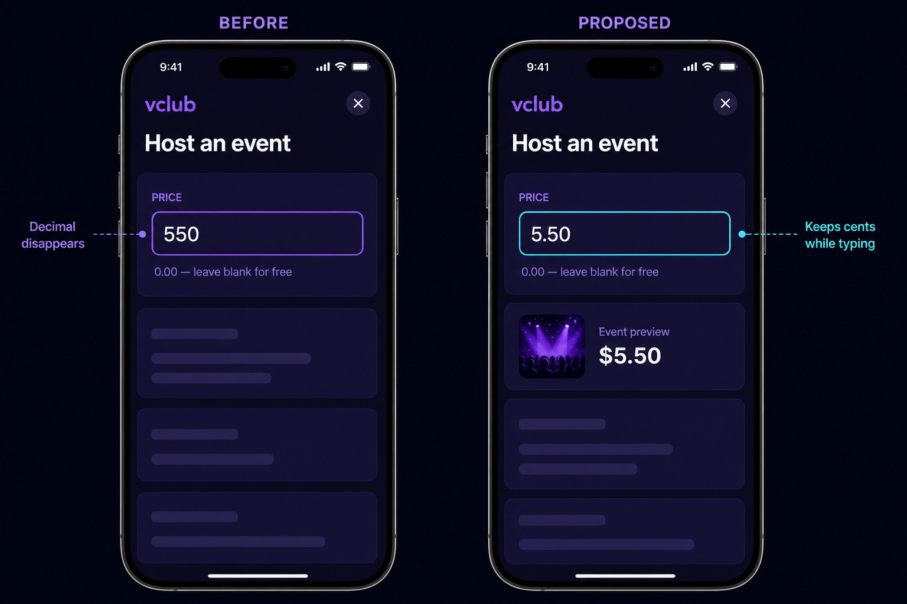

# Issue #44 — decimal event price input

## Approval scope

This mock proposes only the following user-visible behavior:

- the existing event price field preserves a decimal point and trailing zeroes
  while the host types, so `5.50` remains `5.50`;
- the existing free-event hint remains `0.00 — leave blank for free`;
- saved decimal prices display with two decimal places, such as `$5.50`;
- the surrounding host form, controls, layout, and visual system are unchanged.

The comparison board is illustrative. It does not approve a new event-preview
component, phone chrome, or other form redesign.

Approval must be recorded on
[issue #44](https://github.com/bryanw121/vclub/issues/44) before implementation
is committed, as required by `CONTRIBUTING.md`.
