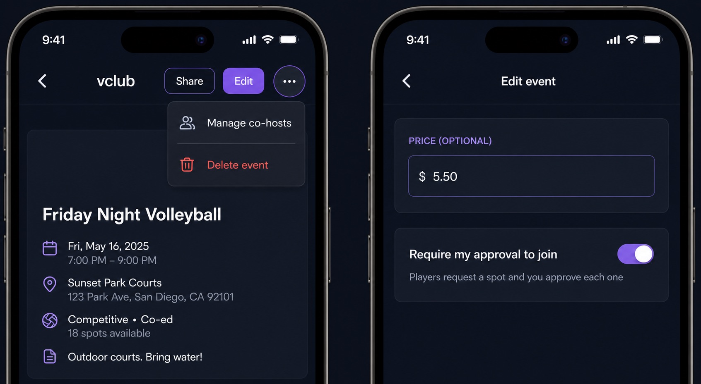

# PR #51 proposed UI: event controls and join approval

Status: **proposed — product-owner approval required before rebuilding PR #51**.

The implementation must match this scope:

- The event header keeps **Share** obvious, makes **Edit** the primary labeled
  action, and moves destructive/rare actions into the overflow menu.
- Every header control has a minimum 44-point touch target.
- Join approval is an explicit setting independent of event price.
- The edit form uses the exact label **Require my approval to join** and, when
  enabled, the helper **Players request a spot and you approve each one**.
- No approval badge is added to feed cards in this PR.

Approval must be explicit and link to this repository-hosted version. Existing
implementation commits predate this artifact and do not count as approved; the
feature branch will be rebuilt after approval.
