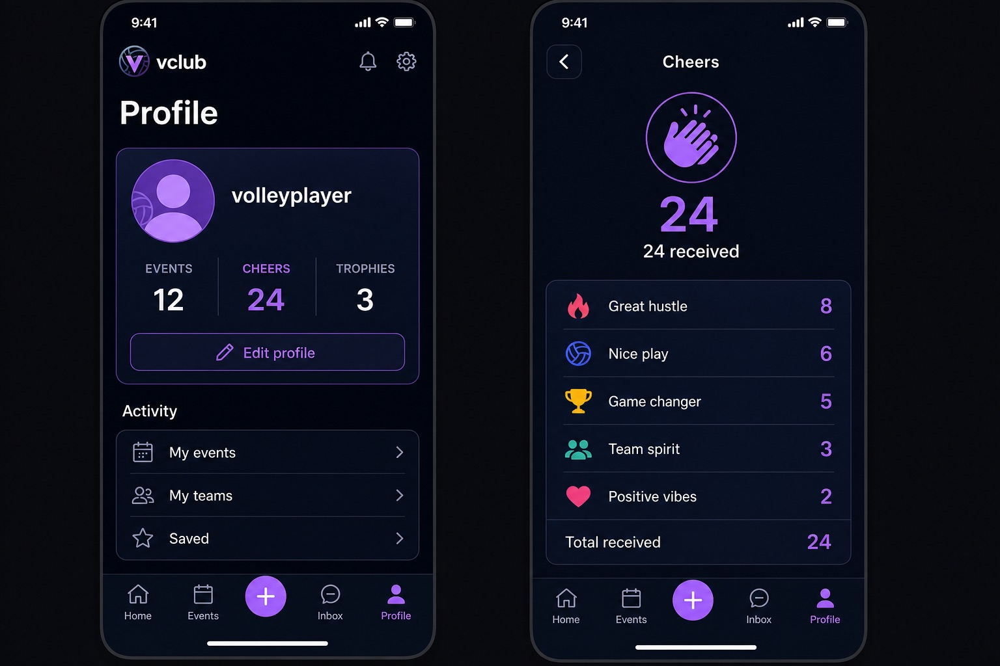

# PR #57 proposed UI: own-profile Cheers count

Status: **approved** in [PR #57](https://github.com/bryanw121/vclub/pull/57#issuecomment-5288702536).

The implementation must match this scope:

- The existing own-profile card layout does not change.
- Its **CHEERS** stat displays the real received-cheers total rather than a
  hardcoded `0`.
- The number matches the total shown by the existing Cheers detail screen and
  refreshes with the profile.
- Trophies and other profile statistics remain unchanged.

The mock uses synthetic values and an abstract avatar; it contains no production
user data. Existing implementation commits predate this artifact and will be
rebuilt after explicit approval.
