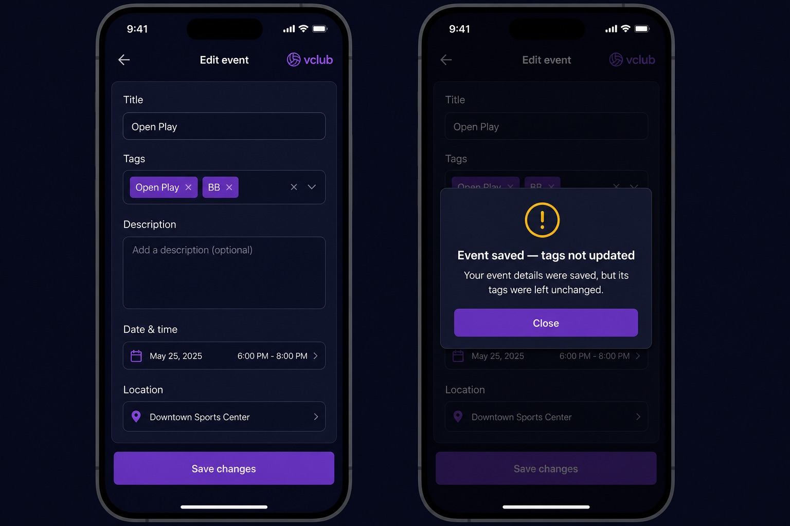

# PR #58 proposed UI: partial tag-save warning

Status: **proposed — product-owner approval required before rebuilding PR #58**.

The implementation must match this scope:

- A successful event-details write followed by a failed tag write opens a
  warning result modal rather than failing silently.
- Title: **Event saved — tags not updated**
- Body: **Your event details were saved, but its tags were left unchanged.**
- The only action is **Close**; the warning does not navigate away or present a
  success celebration.
- Normal success and total-save failure retain distinct messaging.

Existing implementation commits predate this artifact and will be rebuilt after
explicit approval.
