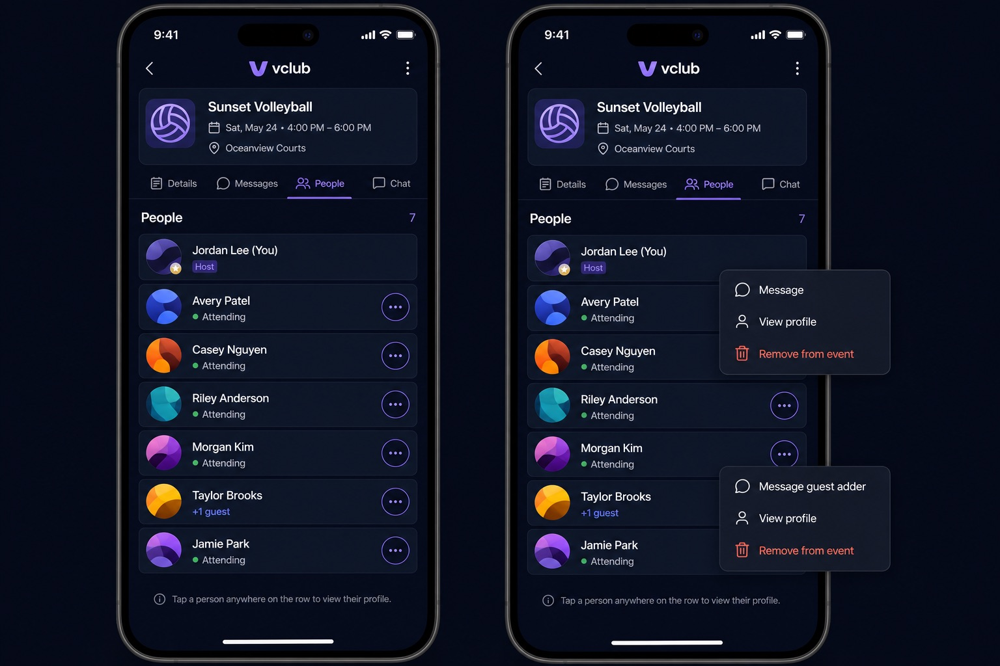

# PR #60 proposed UI: message an attendee from the roster

Status: **proposed — product-owner approval required before rebuilding PR #60**.

The implementation must match this scope:

- In a host/co-host view, an attendee row has a minimum 44-point overflow
  trigger with **Message**, **View profile**, and **Remove from event**.
- Tapping the row itself continues to open the profile.
- Non-host attendees do not get roster-message actions, and the host cannot
  message themselves.
- A `+1` has no account; its action targets the member who added the guest.
- Message-all and attendee-to-attendee roster messaging remain out of scope.

The mock uses synthetic names and abstract avatars. Existing implementation
commits predate this artifact and will be rebuilt after explicit approval.
